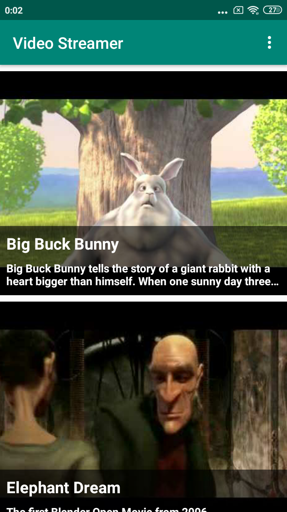
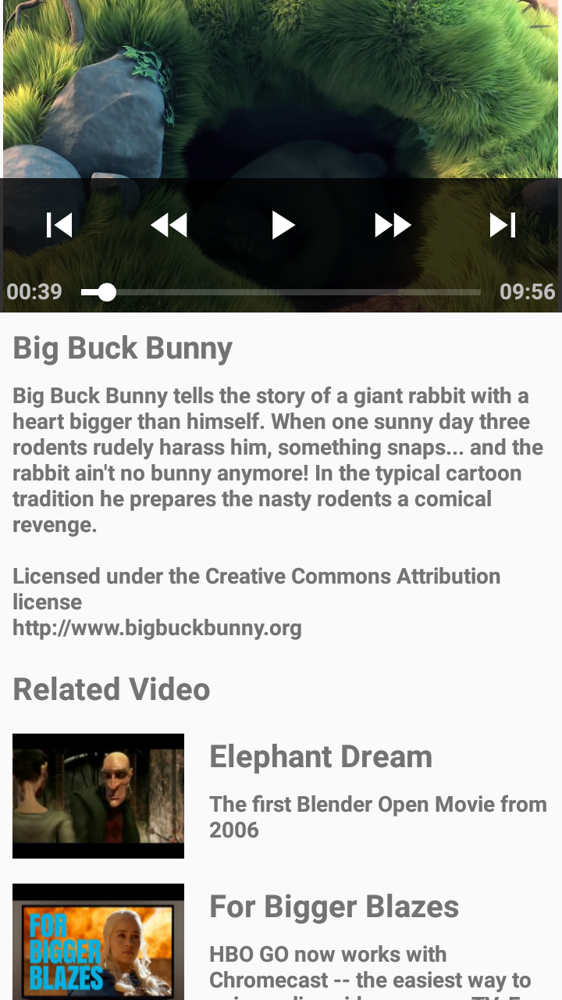

Video Streamer : App to Stream vedios
-----

In this application variety of videos available, once user pause or left vedio there, then after he/she came back that video will play from where they left.

### App Specifications: 

- Kotlin 100% code.
- [ExoPlayer](https://github.com/google/ExoPlayer) : ExoPlayer is used to play videos.
- [Firebase Authentication](https://firebase.google.com/docs/auth) : Firebase Authentication for Google login only, used to register used for app.
- [Firebase Realtime Database](https://firebase.google.com/docs/database): For app realtime data Firebase is used, main use is to store user left which video at which position/time.
- [Glide](https://github.com/bumptech/glide) : To showcase image from url (server).
- [Retrofit2](https://github.com/square/retrofit) : In Vedio all activity retrofit2 is used as networking library.
- [Shimmer Facebook library](https://github.com/facebook/shimmer-android): SHowing progress like layout.

 <!-- - [Release apk]() -->

Screenshot
=====

<table>
  <tr>
    <td>
      
    </td>
    <td>
      
    </td>
    <td>
      
    </td>
  </tr>
</table>

<table>
  <tr>
    <td>
      
    </td>
    </tr>
</table>
